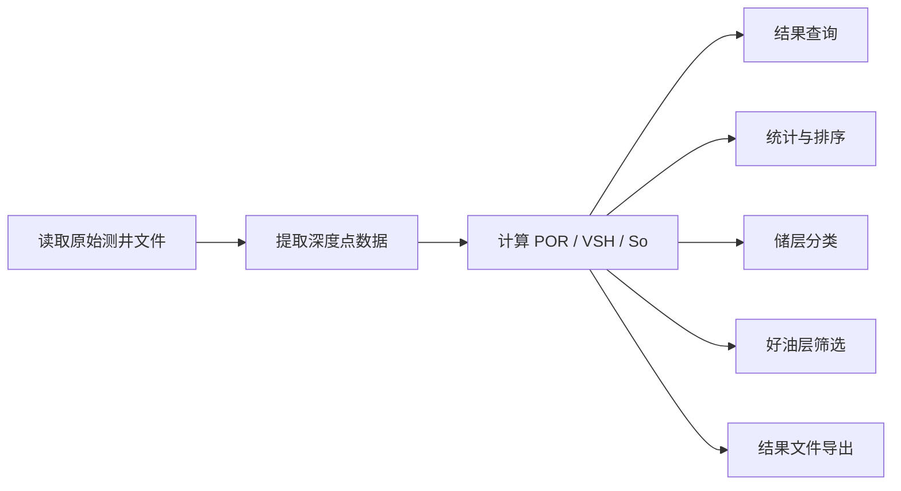

<div align="center">

# 测井数据处理系统

一个基于 Java 的课程项目整理版，用来完成测井数据读取、储层参数计算、结果查询、排序统计和油层筛选。

这份仓库不是把原始作业代码原封不动丢上来，而是把它重新收拾成了一个更适合展示、复用和继续扩展的 GitHub 项目。

<p>
  
  
  
</p>

</div>

## 项目简介

这个项目的核心工作很直接，就是把原始测井数据读进来，算出孔隙度、泥质含量和含油饱和度，然后围绕这些结果做一套常见的课程功能：

- 数据提取与检查
- 测井数据处理与结果导出
- 按深度点序号查询
- 统计最大值、最小值、平均值
- 按含油饱和度排序
- 按储层等级分类
- 查找好油层

如果把它说得再简单一点，这个程序做的就是三件事：

1. 把原始数据从文件里读出来。
2. 用给定公式算出关键储层参数。
3. 把结果做成能查、能排、能统计的分析输出。

## 功能一览

| 模块 | 作用 | 对应结果 |
| --- | --- | --- |
| 数据读取 | 读取测井文件头、参数文件和深度点数据 | 原始测井记录 |
| 参数计算 | 计算 `POR`、`VSH`、`So` | 储层解释结果 |
| 数据检查 | 输出原始数据和检验数据 | `数据提取与检查.txt` |
| 结果导出 | 生成标准化结果表 | `大数据22304班_Results_37.txt` |
| 查询统计 | 按索引、参数和分类进行分析 | 控制台结果 |
| 油层筛选 | 找出满足条件的好油层 | 控制台结果 |
| 结果可视化 | 生成趋势图并弹出窗口查看 | `well-logging-visualization.png` |

## 处理流程



## 核心指标

项目里最关键的三个指标是：

- `POR`：孔隙度，用来表示岩石内部可供流体占据的空间大小。
- `VSH`：泥质含量，用来反映储层中泥质成分的多少。
- `So`：含油饱和度，用来判断储层的含油情况。

对应的思路也比较朴素：

- 先根据声波时差计算孔隙度。
- 再根据自然伽马计算泥质含量。
- 最后结合孔隙度和电阻率估算含油饱和度。

## 仓库结构

```text
well-logging-project
├─ data
│  ├─ parameters.txt
│  └─ well_logging_data.txt
├─ output
│  └─ .gitkeep
├─ src
│  └─ main
│     └─ java
│        └─ cj1
│           ├─ ChartExporter.java
│           ├─ DataHandler.java
│           ├─ IDataProcessor.java
│           ├─ ISystemFunctions.java
│           ├─ MetricType.java
│           ├─ Renwu4.java
│           ├─ SystemFunctions.java
│           ├─ VisualizationFrame.java
│           ├─ VisualizationPanel.java
│           └─ WellRecord.java
├─ .gitignore
└─ README.md
```

## 代码结构

代码现在不再把所有逻辑都挤在一个类里，而是按职责拆开了：

- `DataHandler`
  负责读文件、解析数据、计算基础参数。
- `WellRecord`
  负责保存单条深度点数据，让每个字段都有清楚的名字，不再靠数组下标硬记。
- `SystemFunctions`
  负责菜单功能、输出结果、排序分类和统计分析。
- `VisualizationPanel`、`VisualizationFrame`、`ChartExporter`
  负责把结果画成图，并导出成 PNG。

这样的拆法有一个很直接的好处：看代码的时候，能很快分清楚“谁在读数据、谁在算结果、谁在和用户交互”。

## 相比原始版本的整理和优化

这版仓库做过一轮比较完整的收拾，重点在下面这些地方：

- 把原来写死在 `D:/` 的文件路径改成了项目内相对路径，换电脑也能直接跑。
- 把二维数组下标式写法整理成了 `WellRecord` 对象，代码可读性好很多。
- 把排序逻辑从手写冒泡改成了直接按记录排序，写法更自然，也更不容易出错。
- 把重复打开文件、重复遍历数据的地方收掉了，结构更清楚。
- 把输入校验和错误提示补完整，交互上更稳一些。
- 把结果可视化单独拆成图形模块，既能看窗口，也能直接留 PNG。
- 把项目目录整理成了适合 GitHub 展示的结构，不再像只有一个孤零零的作业文件。

## 快速开始

### 1. 准备数据

把你的原始文件放进 `data` 目录，文件名保持下面这样：

- `data/parameters.txt`
- `data/well_logging_data.txt`

### 2. 编译

在项目根目录执行：

```powershell
javac -encoding UTF-8 -d out src\main\java\cj1\*.java
```

### 3. 运行

```powershell
java -cp out cj1.Renwu4
```

如果你想自己指定数据目录和输出目录，也可以这样运行：

```powershell
java -cp out cj1.Renwu4 data output
```

## 运行后可以完成什么

程序启动后会给出菜单，支持下面这些操作：

- 查看提取出的原始测井数据和检验数据
- 生成测井处理结果文件
- 按深度点序号查看某一条记录
- 统计孔隙度、泥质含量、含油饱和度的最大值、最小值和平均值
- 按含油饱和度从高到低排序
- 统计不同等级储层的数量
- 查找满足条件的好油层
- 打开结果可视化窗口，并导出 PNG

## 输出文件

程序运行后会在 `output` 目录生成：

- `数据提取与检查.txt`
- `大数据22304班_Results_37.txt`
- `well-logging-visualization.png`

## 适合写进课程报告的话

如果你后面要把这个项目写进实验报告或者答辩材料，下面这段可以直接作为思路参考：

> 本系统以测井原始数据为输入，完成数据读取、参数计算、结果查询、储层分类和好油层筛选等功能。程序以孔隙度、泥质含量和含油饱和度为核心解释参数，在完成课程要求的基础上，对代码结构和文件组织进行了整理，使项目更便于运行、展示和后续扩展。

## 后续可以继续完善的方向

如果后面你还想把这个仓库再往上提一点，可以继续做这些事：

- 把公式参数抽到独立配置文件里，减少硬编码。
- 增加异常数据过滤，比如缺失值、空行和异常电阻率。
- 增加示例数据截图或者运行截图，让仓库展示更直观。
- 后续再补图形界面或者可视化模块，项目完整度会更高。

## 说明

这个仓库保留了课程项目本身的应用背景，但在目录结构、代码组织和说明文档上做了规范化整理，更适合作为个人 GitHub 项目展示。
